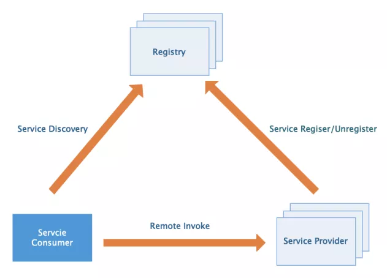

# Rpc-code

RPC(Remote Procedure Call，远程过程调用)是一种计算机通信协议，允许调用不同进程空间的程序。RPC 的客户端和服务器可以在一台机器上，也可以在不同的机器上。程序员使用时，就像调用本地程序一样，无需关注内部的实现细节。

不同的应用程序之间的通信方式有很多，比如浏览器和服务器之间广泛使用的基于 HTTP 协议的 Restful API。与 RPC 相比，Restful API 有相对统一的标准，因而更通用，兼容性更好，支持不同的语言。HTTP 协议是基于文本的，一般具备更好的可读性。但是缺点也很明显：

- Restful 接口需要额外的定义，无论是客户端还是服务端，都需要额外的代码来处理，而 RPC 调用则更接近于直接调用。
- 基于 HTTP 协议的 Restful 报文冗余，承载了过多的无效信息，而 RPC 通常使用自定义的协议格式，减少冗余报文。
- RPC 可以采用更高效的序列化协议，将文本转为二进制传输，获得更高的性能。
- 因为 RPC 的灵活性，所以更容易扩展和集成诸如注册中心、负载均衡等功能。

# 分布式rpc框架要素

- 服务提供方 Serivce Provider
- 服务消费方 Servce Consumer
- 注册中心 Registery

围绕上面三个基本要素可以进一步扩展服务路由、负载均衡、服务熔断降级、序列化协议、通信协议等等。

### **1 注册中心**

主要是用来完成服务注册和发现的工作。虽然服务调用是服务消费方直接发向服务提供方的，但是现在服务都是集群部署，服务的提供者数量也是动态变化的，所以服务的地址也就无法预先确定。因此如何发现这些服务就需要一个统一注册中心来承载。

### **2 服务提供方（RPC服务端）**

其需要对外提供服务接口，它需要在应用启动时连接注册中心，将服务名及其服务元数据发往注册中心。同时需要提供服务服务下线的机制。需要维护服务名和真正服务地址映射。服务端还需要启动Socket服务监听客户端请求。

### **3 服务消费方（RPC客户端）**

客户端需要有从注册中心获取服务的基本能力，它需要在应用启动时，扫描依赖的RPC服务，并为其生成代理调用对象，同时从注册中心拉取服务元数据存入本地缓存，然后发起监听各服务的变动做到及时更新缓存。在发起服务调用时，通过代理调用对象，从本地缓存中获取服务地址列表，然后选择一种负载均衡策略筛选出一个目标地址发起调用。调用时会对请求数据进行序列化，并采用一种约定的通信协议进行socket通信。

